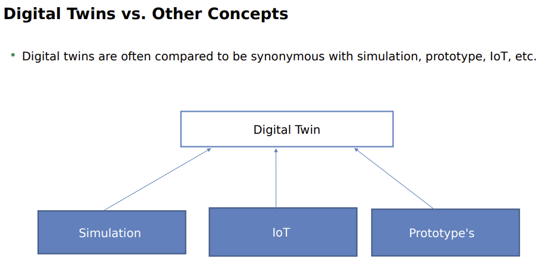
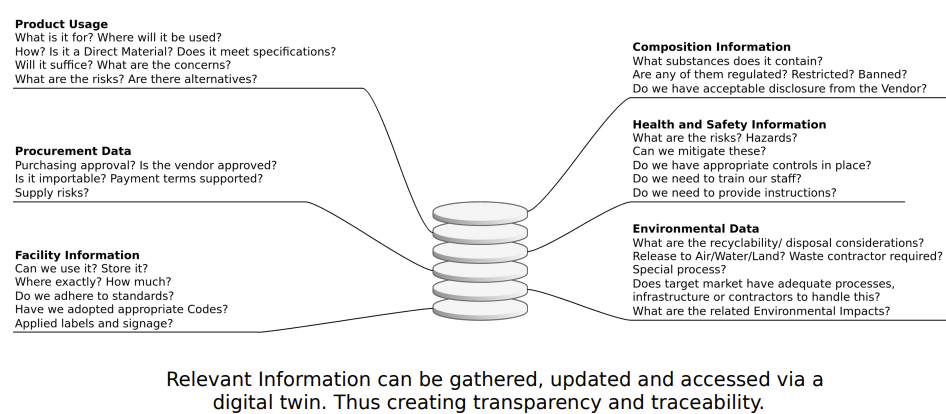
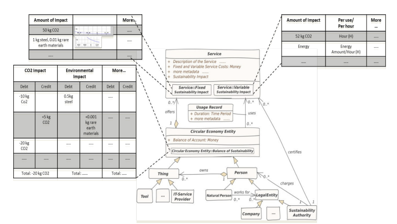
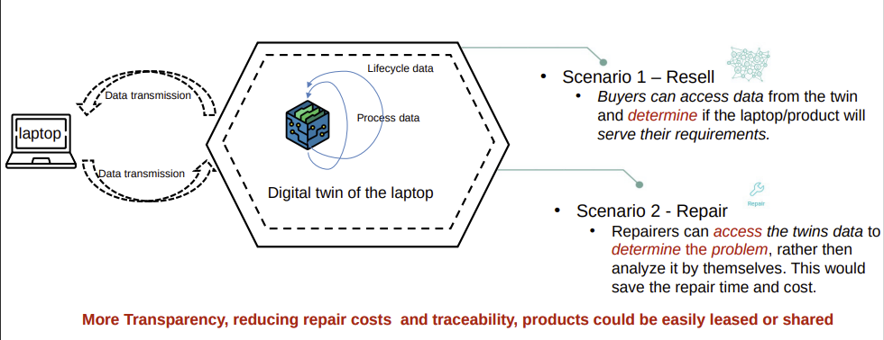
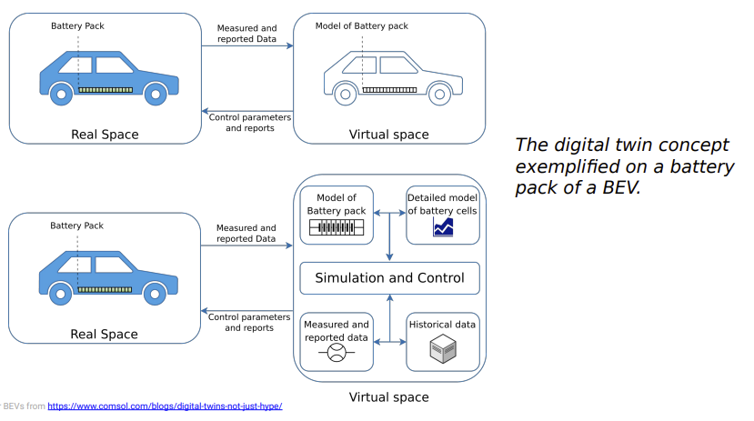

- A digital twin is a virtual representation that serves as the real-time digital counterpart of a physical object or process
- Digital twins are the result of continual improvement in the creation of product design and engineering activities.
- Product drawings and engineering specifications have progressed from handmade drafting to computer-aided drafting/computer-aided design to model-based systems engineering
- Digital Twins and other concepts
	- 
	- Use Cases
		- Supply Chain Transparency
			- 
		- Sustainability Impact Factor
			- 
		- Increasing the Longevity of Electronics
			- 
		- Battery Electric Vehicles
			- 
	-