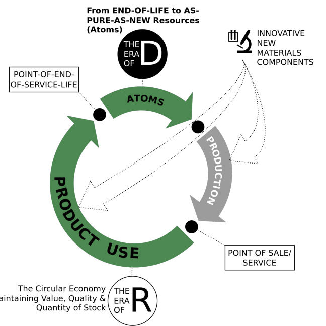

- = Technologies and actions to recover atoms and molecules at 
  highest quality (purity and value) level as pure as virgin:
	- 1 De-polymerise
	- 2 De-alloy
	- 3 De-laminate
	- 4 De-vulcanise
	- 5 De-coat materials
	- 6 De-construct high-rise buildings and major infrastructure
	-
- 
-