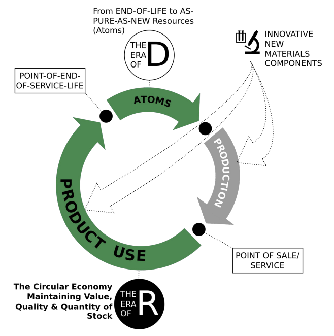

- = Techno-commercial strategies to keep goods and components at   
    highest value level through the following principles.
	- 1 Reuse
	- 2 Repair
	- 3 Remarket
	- 4 Remanufacture
	- 5 Re-refine
	- 6 Reprogramme goods
- 
-