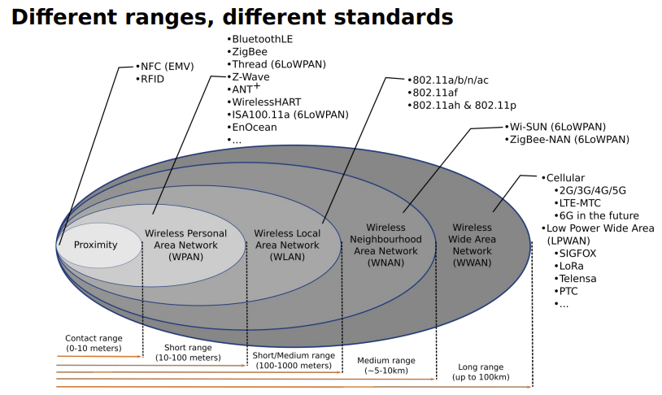

- Standards and their ranges
	- 
- [[Communication Standards]]
	- [[WPAN (Wireless Personal Area Network)]] 10 - 100m
		- IP Based
			- [[6LoWpan]]  (IPv6 over Low-Power Wireless Personal Area Networks)
			- [[IEEE 802.11p]] (V2V)
		- Not IP Based
			- [[Bluetooth]]
			- [[ZigBee]]
	- [[Wan (Wide Area network)]] up to 100km
		- = Subscription Service, from provider who runs infrastructure
		- Examples
			- [[Cellular networks (UMTS/LTE/5G)]]
			- [[LoRa]] (Long Range, physical layer), LoRaWAN (MAC layer)
			- [[Sigfox]]
		- [[Cellular network architecture]]
			- = Grid of cell towers, with overlapping cells. Requires a Handover between Cells
			- [[Network Planning]]
				- Space division multiple access
				- Minimize interference
				- Avoid allocating overlapping spectrum on nearby cells
	- [[Router and Gateways]]
		- [[Router]]
			- Bridges two networks
			- Can translate between protocols
			- Routes data
			- Port forwarding and network address translation (mainly end user or carrier grade)
			- VNETs
		- [[Gateways]] (not in the routing sense)
			- Functionality
				- Bridges wireless network and internet
				- Can translate between protocols
				- Edge/Fog computing capabilities (see next lecture)
				- Routers can be gateways
			- Example
				- Wireless sensor nodes running Contiki RPL with Ipv6
				- Node attached to gateway over USB acts as gateway
				- IPv6 connectivity between networks provided through SLIP (Serial Line Internet Protocol)