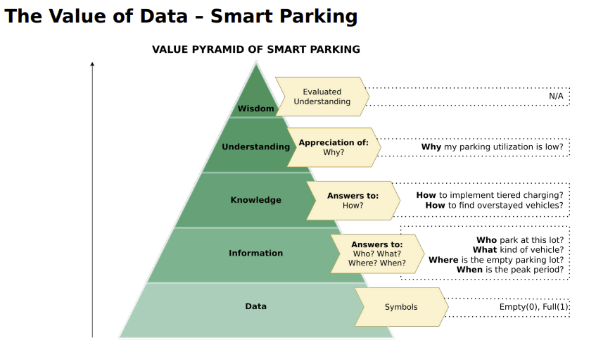
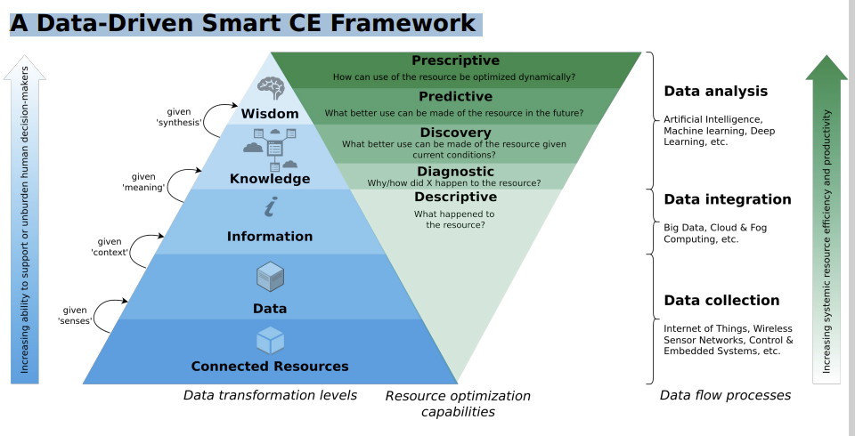

- Definition
	- “Objects with computing devices in them that are able to connect to each other and exchange data using the internet.”
- History
	- 1982: Beverage dispenser with an Internet connection
	- 1991: Vision of Ubiquitous Computing
	- 1999: Kevin Ashton → IoT refers to the linking of clearly identifiable physical objects (things) with a virtual representation in an Internet-like structure.
- IIoT vs IoT
	- IoT = Connect Low Cost End Point Devices
	- [[IIoT]] =   connected industrial High cost Asset Connect Low Cost End Point Devices
		- IT and OT in IIoT
			- [[IT]] = common term for spectrum of information processing, including software, hardware, communications technologies and related services
			- [[OT]] = detects Cause of Change through direct monitoring, and or control of ohysical devices, processes and events in the enterprise
- [[IoT Examples]]
	- connected Cars
	- [[Machine to everything]]
		- Machine-to-Human (M2H)
			- For example → Transportation-as-a-Service
		- Machine-to-Machine (M2M)
			- For example → Road space negotiations
		- Machine-to-Infrastructure (M2I)
			- For example → Smart parking, battery charging or traffic information
		- M2X Economy → Is the result of business interactions, transactions and collaborations among entities of the M2X ecosystem.
	- Agriculture
		- Farming data (cloud Data, no inspections)
		- Survey Drones (mapping weeds, soil variation)
		- Texting Cows (Sensors on Livestock, higher Wellbeing)
		- Fleet of Agrirobots (fertilising field efficiently)
		- Smart Tractors (optimated steering, less soil eroison)
	- Smart Cities
		- Sensors in e.g. Lights and Garbage bins for optimized energyconsumption
- [[The Value of Data]]
	- Notations
		- 
- A Data-Driven Smart CE Framework
	- 
	  id:: 62dd4b31-fdb3-4231-9082-00aca0115b5c
- [[Sensors]]
	- Conventional Sensors
		- Status values
			- deliver defined Value when measurement occurs
				- Push-button
				- Reed switch
				- Hall sensors
		- Continous Values
			- provide Value depending on Measurement
				- recquires A/D Converter (Analog to digital)
	- Smart Sensors
		- = sensors with integrated info processing
			- Programmable temperature sensor and thermostat
	- Further Sensors
		- Distance Sensor
		- Ultrasound, radar or infrared sensors
- [[Actuators]]
	- Attributes and Examples
		- Light as indicator (LEDs)
		- intelligent Displays
		- Acoustic indicators
		- electrical Switches
	- Source of Power
		- Solar energy
		- Piezo generator (conversion of mechanical energy – vibration, motion, sound)
		- Radio wave energy generation (RFID)
	- Energy Consumption
		- Depends on computing power, Active sensors, frequengy of Data collection etc.
	- Energy Storage
		- Does a battery fit into the system?
		- What is the capacity of the battery?
		- Can a battery provide sufficient voltage and current?
		- Can the battery be replaced?
		- Battery weight
		- Battery charging frequency
		- Is the battery exposed to temperature fluctuations?
		- Deep discharge?
		- Type of battery (Li-ion, lead, NiCd, etc.)
	- IoT Devices – Development (WSN) (Wireless sensor networks)
		- low powered devices (8 bits)
		- Common Architeture
		- standardized connectors for sensor Boards
		- low powered Wireless Standards
	- IoT Devices - Consumer
		- Smart Home devices
		- locks
		- lights
		- watering plants
	- IoT Devices - industrial
		- Sensing State of Machinery
		- Irrigation (Bewaesserung)
		- Environmental monitoring
		- Smart Grid
	- Ingress Protection (IP) 
	  Codes
		- IP Codes: Degree of protection provided by mechanical casings and electrical enclosures 
		  against intrusion, dust, accidental contact, and water.
		- The higher the better