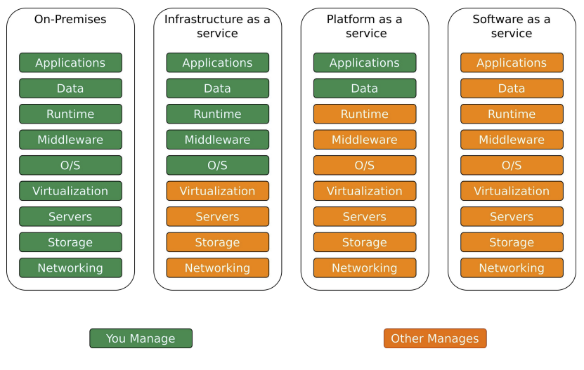
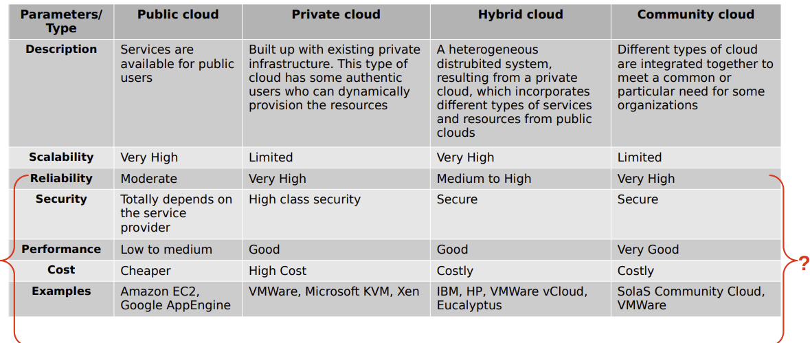
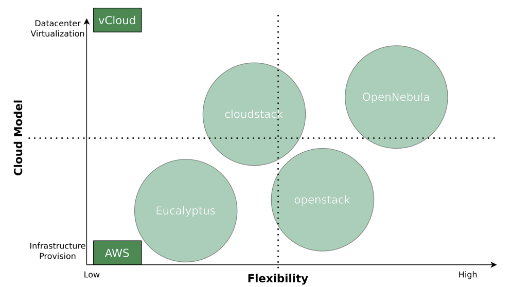
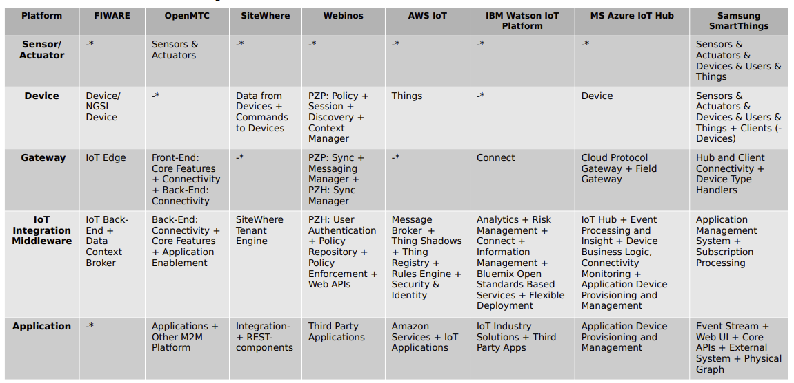
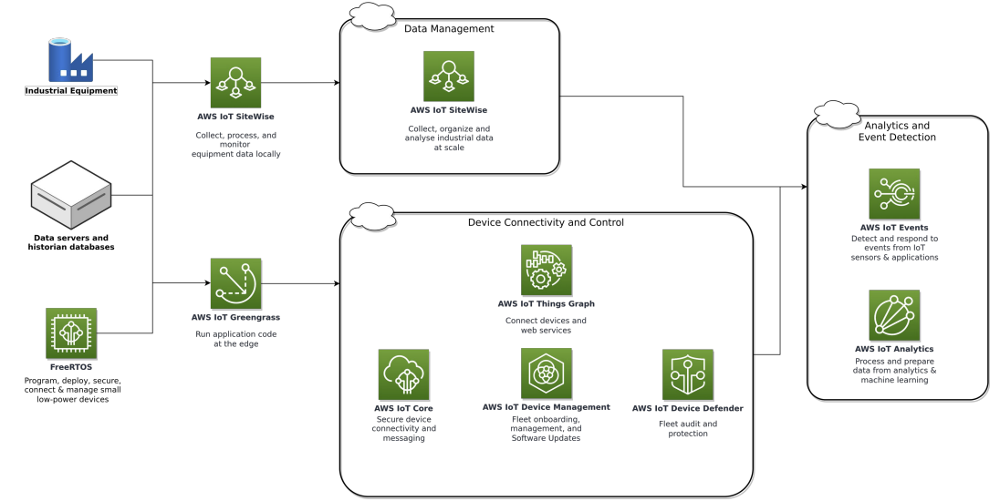
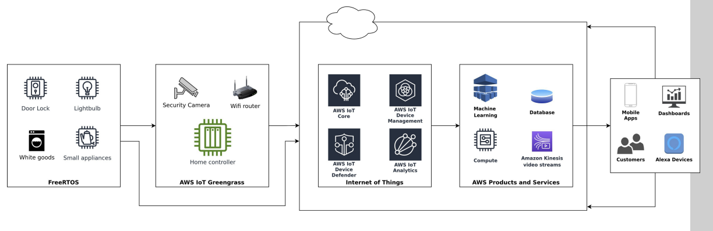
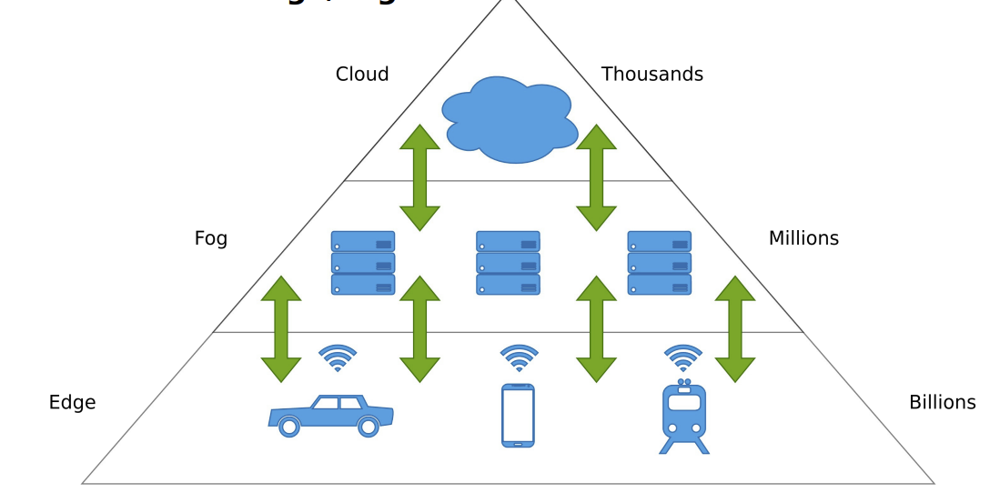
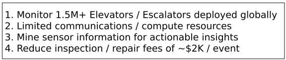
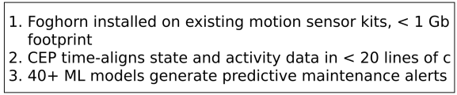
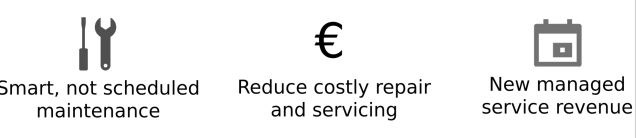

public:: true

- Cloud Computing
	- = “Cloud computing is a model for enabling ubiquitous, convenient, on-demand network 
	  access to a shared pool of configurable computing resources (e.g., networks, servers, 
	  storage, applications, and services) that can be rapidly provisioned and released with 
	  minimal management effort or service provider interaction.”
	- Management participation
	  collapsed:: true
		- 
	- Categories
		- Infrastructure as a Service (IaaS)
			- AWS - 33% market Share
			- Azure - 21 % Market Share
			- Google Compute engine - 10%
		- Platform as a Service (PaaS)
			- Google App Engine
			- Heroku
			- AWS Elastic Beanstalk
		- Software as a Service (SaaS)
			- Google Apps
			- Dropbox
			- Zoom
	- Billing Models
		- Pay per Use
		- Pay per User
		  id:: 62deb0a8-1bef-4ef1-a8a0-8da32eadc4c5
		- Base Fee + Pay per User
		- Pay per bandwidth
		- Pay per Transaction
	- public, hybrid and private Clouds
	  collapsed:: true
		- 
		-
	- Data Protection and Privacy
		- Am I allowed to transfer the data to the cloud? (e.g. patient data)
		- Does the data have to be encrypted and/or anonymized/pseudonymized?
		- Am I allowed to transfer data to foreign servers?
		- Liability issues in the event of data loss and data manipulation
		- Access to the data on the part of the cloud provider, third parties or secret services
		- Cloud service is temporarily unavailable (SLAs – Service Level Agreements)
	- Self Hosted computing clouds - comparison
		- 
	- IoT Clouds
		- Applicatrion Domain of IoT cloud Plattform
			- Resaerch
			- App development
			- Device management
			- System Management
			- Data management
		- Attrtibutes and definition of Iot Plattforms
			- = IoT platforms are the support software that connects everything in an IoT system, thereby facilitating communication, data flow, device management, and the functionalities of applications.
			- Attributes
				- Connect hardware, such as sensors and devices
				- Handle different hardware and software communication protocols
				- Provide security and authentication for devices and users
				- Collect, visualize, and analyze data the sensors and devices gather
				- (External) web-service or application integration
		- examples IoT Clouds
			- AWS IoT
			- ThingSpeak
			- Samsung Artik Cloud
			- Microsoft Azure IoT Platform
				- comparison
					- 
				- AWS IoT for Industrial Applications
					- 
				- AWS IoT for the Connected Homes
					- 
	- [[Edge/Fog Computing]]
		- ~~  Edge computing shifts the computing capacity from central servers or the cloud closer to 
		  the IoT devices themselves. Thus, allowing for faster data processing, shorter response 
		  times, and saving bandwidth.
		- Edge Computing definition
			- = “Edge computing refers to the enabling technologies al-lowing computation to be 
			  performed at the edge of the network, on downstream data on behalf of cloud services 
			  and upstream data on behalf of IoT services”
		- Fog Computing definition
			- = “Fog computing is a geographically distributed computing architecture with a resource 
			  pool consists of one or more ubiquitously connected heterogeneous devices (including 
			  edge devices) at the edge of network and not exclusively seamlessly backed by cloud 
			  services, to collaboratively provide elastic computation, storage and communication 
			  (and many other new services and tasks) in isolated environments to a large scale of 
			  clients in proximity.”
		- Architecture
		  collapsed:: true
			- 
		- Why use it?
			- Data volume to large
			- Network latency
			- Costs (data transport constraints/limitations
		- Actors
			- Devices - perform simple data Validation
			- Edge/Fog - performs more complex data validation, storing and forwarding
			- Cloud - performs full data validation, storing and analytics
	- Foghorn Example - Optimzing elevator performance
		- Challenges
		  collapsed:: true
			- 
		- Solution
		  collapsed:: true
			- 
		- Benefits
		  collapsed:: true
			- 
	- Big Data
		- definition
			- = “BigData represents the information assets characterized by such a high volume, 
			  velocity and variety to require specific technology and analytical methods for its 
			  transformation into value”
		- 4 V's
			- Volume
				- Large amounts of structured and unstructured data
				- Various heterogeneous sources
				- Several TBs up to hundreds of PBs
			- Velocity
				- Rate at which new data is generated
				- Speed at with which data is transferred and analyzed
				- Best Case:
					- Data processing is faster than data generation
					- Process data while it is being generated without having to write it into a database
			- Variety
				- Heterogeneity of data
				- Structured vs. unstructured
				- Data type and structure partly unknown (text, audio, video, etc.)
				- Who generates the data?
					- Humans
					- Sensors
					- Machines
						- Hardware
						- Software
			- Veracity
				- How accurate is the collected data → Can I trust it?
				- Lower quality can be compensated for by higher volume if necessary
				- Challenges:
					- Tweets with spelling mistakes or abbreviations.
					- e.g. u→you, thr→there, teh→the
				- Bias of data (e.g. political).
				- Detect and filter noise and abnormalities
		- Challenges
			- DataVolumes - can be extraordinarly high
			- Scalability - can be hard to organize
	- Data Analytics
		- Overview
			- Includes the process of inspection, cleaning/preparation, transforming and modelling data 
			  for the purpose of extraction of useful information.
			- Extracted information is the basis for subsequent decision-making processes
			- Often in conjunction with data visualization
			- =>  Value of collected data depends on their interpretation and the decisions that are made on the basis of the data.
		- From Information to optimization
			- Descriptive Analysis - What happened
			- Diagnostic Analysis - Why did it Happen
			- Predictive Analysis - What will happen
			  collapsed:: true
				- Classification of new observations on the basis of training data from the past
				- It is not a question of predicting the future!
					- → Instead, to calculate the probability of the (non-)occurrence of an event with a 
					  certain degree of reliability.
				- Possible applications in the creation of what-if scenarios, Risk management or outlier 
				  analyses
			- Prescriptive Analysis - How can we make it happen
		- Real Time Data Analytics
			- When do I analyze Data
				- After an Event has occured - Data at rest
				- While an Event occurs - data in Motion
			- Stream Processing
				- Problem
					- Processing of continuous data streams
					- Answering question X without delay
				- Examples
					- E-commerce order processing
					- Credit card fraud detection
					- Spam detection
				- Properties
					- Results for question X based on current data
					- Calculation on individual data set or for a small time window
					- Optimized for low latency
					- Calculations close to "real-time" and often very simple
					- Example frameworks: Apache Storm or Amazon Kinesis