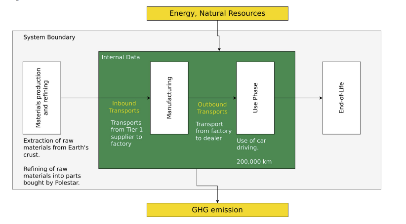
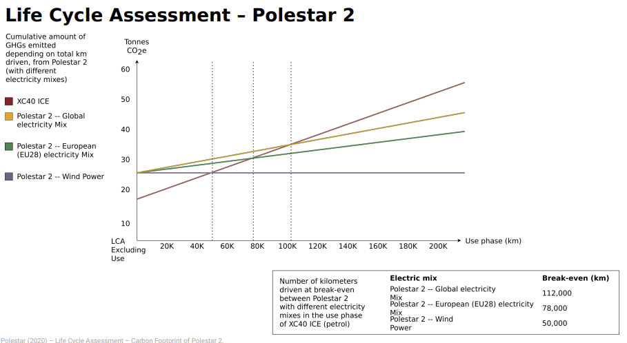

- =The life cycle assessment is an instrument that allows for a holistic, systematic recording 
  of environmental impacts and an evaluation of a balance object in order to enable the 
  comparison of alternatives. Balance objects can be products, processes, companies or 
  behaviors.
	- Polestar example
		- Step 1
			- 
		- Step 2
			- 
		- Step 3
			- 
		- Step 4
			- 
		- Step 5
			- 
		- Step 6
			- 
		- Step 7
			- critical Discussion
				- Data Validity etc.
				- 
				-