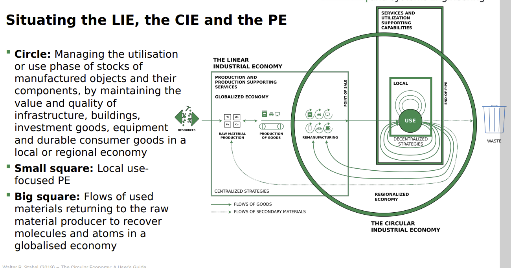

- [[circular economy]]
	- characteristics
	- the Owner of a Procuct controlls its future use
	- idealy this ends in local Loop with low or none degenreration of Value
	- maintaining Value, Quality and Quantity of Stock
		- [[Era of R]] = Techno-commercial strategies to 
		  keep goods and components at 
		  highest value level through
			- 1 Reuse
			- 2 Repair
			- 3 Remarket
			- 4 Remanufacture
			- 5 Re-refine
			- 6 Reprogramme goods
		- [[Era of D]] = Technologies and actions to 
		  recover atoms and molecules at 
		  highest quality (purity and value) 
		  level as pure as virgin.
			- 1 De-polymerise
			- 2 De-alloy
			- 3 De-laminate
			- 4 De-vulcanise
			- 5 De-coat materials
			- 6 De-construct high-rise buildings 
			  and major infrastructure
		- [[End-of-service-life]] business opportunities for value   
		    preservation: Reuse or Recycle?
			- 1 non destructive Collection of Waste
			- 2 Decision Reuse or Recycle
				- Reuse = High Value Route
					- Objects get repuposed, after e.g. repair.
					- part of [[Era of R]]
				- Recycle = Low Value Route
					- Objects get recycled
					- part of the [[Era of D]
	- [[sustainability]]
		- Implications of Sustainibility
		- Consume less
	- Two [[absolute decoupling indicators]] of the CIE (Circular industrial Economy) monitoring
		- = more wealth and jobs from less ressource consumption
			- [[linear industrial Economy]]
				- Low hr/kg (labor input per weight) ratios, coherent with massproduction in highly mechanized processes, and low to medium €/kg (value per weight) ratios, in a range from 
				  basic materials like cement to smart goods like USB memory sticks.
			- [[Circular economy]]
				- Higher hr/kg and €/kg ratios for reuse, remanufacture and 
				  selling performance (goods as a service), in a group with new technologies, such as 
				  life sciences and nanotechnologies, which by nature produce dematerialized objects.
- [[Performance Economy]]
	- ~~ Sells results instead of Objects, Actors sell the use of durable Objects as a Service over long time periods
	- Arguably the most sustainable Business Model
		- Stahel argues:
			- ~~ because by internalising the costs of product liability, of 
			  risk and waste, it offers manufacturers a strong financial incentive to prevent losses and waste. (The Producer is interested in durability of Product)
			- “It maximises the profit potential by exploiting sufficiency, efficiency and systems solutions.”
			- “In addition, by maintaining the ownership of objects and embodied resources, it creates long-term corporate and national resource security at low cost.
	- Situating LIe Cie and PE
		- 
		-
	- Examples:
		- Foodsharing - How it Works =
			- Register (free – no charges, no subscriptions)
			- Types of users:
				- User
					- Share your own leftovers or collect food from others (offers visible on the Foodsharing 
					  map)
			- 2. Foodsavers
				- Pass a quiz (quite some effort) and become a Foodsaver.
				- Allowed to collect (“save”) leftovers from businesses that cooperate with Foodsharing
				- Redistribute saved food among friends and within the Foodsharing community
			- 3. Operations manager (Betriebsverantwortlicher = abbr. “BV”)
				- Manage cooperation with business, manage your team of Foodsavers and organize a 
				  collection schedule