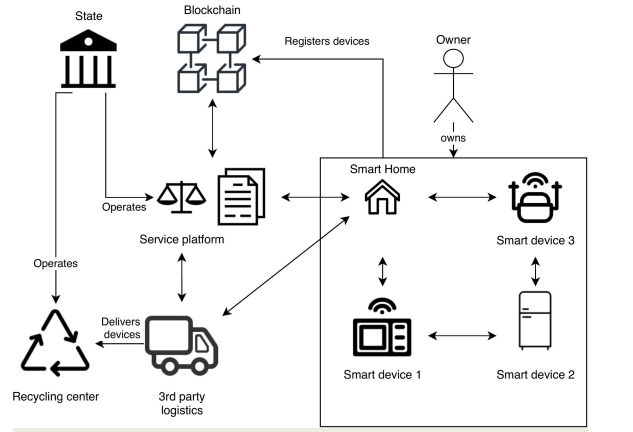

- Materials
	- [[Material Flow]]
		- 1 extraction of the raw Material
		- 2 various stages of refinement
		- 3 use/consupmtion of the Product
		- 4 (if possible) reuse/ recovery
		- 5 disposal of product
	- [[Material Flow Management]]
		- goal oriented and efficeient use of materials/ streams and energy
		- goals are set ecological or economical by observing social aspects
	- Questions of [[Material Flow Analysis (MFA)]]
		- 1 which flows are relevant?
		- 2 which actors use the materials in which processes?
		- 3 in which quantities are materials used, extracted and discharged into the environment?
	- [[Life Cycle Assessment (LCA)]]
		- allows recording of environmental impacts
		- allows evaluation of a balance Object (= products processes, companies or behaviors) to enable comparison of alternatives.
			- e.g. Polestar; Slide 19-24
			- e.g. Automative industrie, Smart Cities; Aviation and Aerospace; Human Medicine; Slide 33 - 34
		- [[Digital Twins]]
			- = A digital twin is a virtual representation that serves as the real-time digital counterpart of a physical object or process.
		- [[Hitchhiking for E-Waste]]
			- How to reuse E Waste at Home(with Blockchain Technology)
			- 
			- Or just Resell on e.g. kleinanzeigen
		- [[Future Ressources]]
			- [[Buildings as Material Banks (BAMB)]]
				- Website:
					- BAMB is creating ways to increase the value of building materials. Dynamically and flexibly designed buildings can be incorporated into a circular economy – where materials in buildings sustain their value. That will lead to waste reduction and the use of fewer virgin resources.
			- [[Landfill Mining]]
	- [[MFA vs. LCA]]
		- MFA is a component of LCA
		- MFA includes no environmental accesment
		- MFA is for qualitative/ quantitive assement of Material Flows
		- LCA performs environmental assesment through quantification of environmantal effects
	- [[DIGITAL CIRCULAR ECONOMY AND BUSINESS 
	  MODELS]]
		- [[Circular Economy Business Models]]
			- = intensifiying, dematerializing, closing, slowing and Narrowing of Ressource Loops
			- [[A Data-Driven Smart Circular Economy Framework]]
			- [[Performance Economy and/to Sharing Economy]]
- EMERGING TECHNOLOGIES FOR THE CIRCULAR 
  ECONOMY
	- disruption of existing economical Models through new Technologies
		- unsatisfying state if Circular economy due to lack of sufficently developed Technologies
		- difficulties for stakeholders to combine necessary technologies to enable a working Circular economy