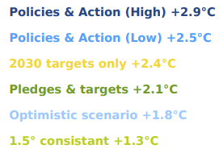
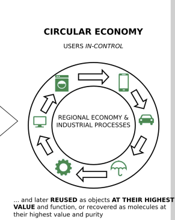

- Motivation
	- Ressource shortage
		- Due to different Factors like **Ressources, Population, Pollution Food per Captia and industrial Output per Captia Humanity** will face different Crisis. This gets highlightes in the Book [[The Limits to Growth]]
		- **Zeitpunkte**
	- We only have one planet
		- Environmental Pollution
			- 3 of the 10 dirtiest European coal plants are 
			  located in Poland
			- 7 of the 10 dirtiest European coal plants are 
			  located in GERMANY
		- Climate Change
			- 2100 Warming predictions based on current regulations
				- 
			- Health impacts of climate change
				- diseases and undernutrition
				- Floods Heatwaves Droughts fire
				- loss of habitation Poverty mass migration
				- violent conflicts
	- Key challenges of the 21st century
		- 1) Climate change / Adaption to climate change
		  2) Environmental pollution
		  3) Dwindling non-renewable ressources
	- Problem is not solvable with only a reduction in C02 Emititions, Companies try to use CO2 Footprint as a marketingtool also called [[greenwashing]]
		- For Example ipad Pro11'
			- 1) Gobs of adhesive hold most everything in place, making all repairs more difficult.
			  2) The battery is secured with both easier-to-remove stretch-release tabs and conventional, non removable adhesive.
			  3) The USB-C port is modular and can be independently replaced.
		- Carbon Footprint was invented by BP
		- How am i contributing
			- Emotional Ecological Liabilities
				- like Dogs and other Pets
	- The [[linear industrial Economy]]
		- can be defined as “Take – Make – Dispose
			- Levels
				- Resources
				- manufacturing
				- Distribution
				- Point of sale
				- ....
		- Waste Management as a Consumer problem
			- Liability for Company stops after the Point of sale
			- Zero Life Products are disposed bevor they could be sold
			- Horrible Wate Management Example
				- Nuclear energy - disposed in ocean
				- plastic in ocean
		- Recycling is no perfect Solution
			- 1 Recycling often requires a lot of energy
			  2 Some materials cannot be recycled at all (yet)
			  3 Impurities are challenging
			  4 Often requires a lot of manual labor
			  5 Recycled material often with lower quality than input material
			  6 False sense of safety
			- Conclusion
				- Waste = Inefficency
	- Circular Ecnomy
		- The User is in Control of reusing goods after the point of sale
		- 
		-